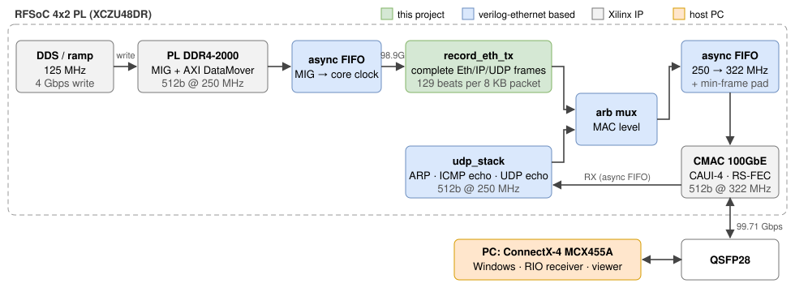
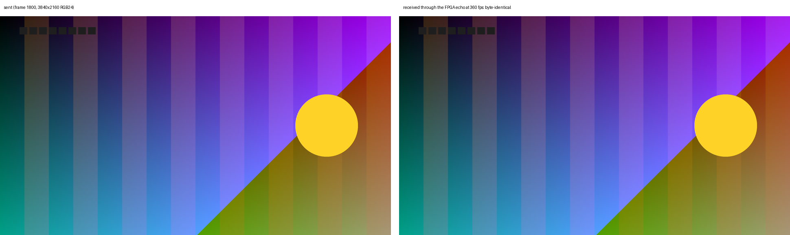

-9A90FD.svg)    

[English](#en) | [中文](#cn)

　

<span id="en">RFSoC 4x2 100G UDP over QSFP28</span>
===========================

Hardware UDP/IP on the RFSoC 4x2 (XCZU48DR-FFVG1517-2-E) 100GbE QSFP28 port: ARP, ICMP echo, UDP echo, and a stream of PL DDR4 data at **99.71 Gbps, the full 100GbE line rate for 8 KB jumbo packets, received on Linux with every sample checked**. **4K video (3840x2160 RGB24) loops through the FPGA at up to 440 fps (87.7 Gbps each way)**, every frame byte-exact.

The host side runs on Linux with DPDK: on Windows the receive path could not keep up with 100G. The 25G version with its Windows host is [rfsoc4x2_25g_udp](https://github.com/uceeyuf/rfsoc4x2_25g_udp).

Built on Alex Forencich's [verilog-ethernet](https://github.com/alexforencich/verilog-ethernet) (MIT), included as a submodule pinned at `274831c`. `rtl/stack/` holds 512-bit (`DATA_WIDTH`-parameterized) versions of its IP/UDP modules.

　

|  |
| :-------------------------------: |
| **Figure1** : 100G data path      |

　

## Technical Features

* **512 bit @ 250 MHz** (128 Gbps) from the DDR4 read port through the UDP/IP stack; 28 % above the 100GbE line rate, so the per-packet idle cycles of the 512-bit stack never limit a 100G echo. The IPv4 header checksum is summed in an input register stage of `ip_eth_rx_512`, which closes timing at 250 MHz.
* **DDR4 is not the limit**: DDR4-2400, 64 bit (153.6 Gbps peak, MIG 512 bit @ 300 MHz) reads at the full 128 Gbps of the core side, also while 4 Gbps of DDS data are written at the same time (DDR4-2000: 113.9 Gbps).
* **Data plane separate from control plane**: `record_eth_tx` builds complete Ethernet/IPv4/UDP frames. The 42-byte headers plus a 22-byte record header fill exactly the first 64-byte beat, so the DDR data follow unshifted: 129 beats per 8 KB packet, no idle cycle. ARP, ping and UDP echo go through the verilog-ethernet stack; both are merged in front of the MAC.
* **Record integrity**: DDR writes stop only at record boundaries, and reads still in flight are drained when the stream stops, so `start_index = 0` is always sample 0 of a record.
* **Multi-flow**: up to 31 flows rotating UDP ports and source IP (RSS spreading), runtime packet gap. Besides `192.168.100.1` the FPGA answers ARP and UDP echo on the alias addresses `.128`–`.159` and replies from the address a packet was sent to, so echo flows spread over the receive queues of the PC.
* **Echo buffers**: 256 KB RX FIFO and 256 KB echo FIFO absorb line-rate bursts; per-second hardware counters (VIO) for every stage of the stream and the echo.

　

## Performance Test Results

Host: Core Ultra 7 265K, Mellanox ConnectX-4 (PCIe 3.0 x16), Ubuntu 24.04, DPDK 24.11.3 (mlx5 PMD).

FPGA side (`tests/bench.tcl`, VIO counters), PL DDR4-2400, calibration passes every stage at tCK 833 ps:

| Test                                       | MIG read    | MIG write | Wait for DDR | Into the CMAC  |
| :----------------------------------------- | :---------: | :-------: | :----------: | :------------: |
| DDR4 read → discarded at 250 MHz           | **128.00 Gbps** | 0     | 0 %          | –              |
| DDR4 read + write → discarded              | **128.00 Gbps** | 4.00 Gbps | 0 %      | –              |
| DDR4 read → `record_eth_tx` → CMAC         | 98.94 Gbps  | 0         | 0 %          | **99.71 Gbps** |
| DDR4 read + write → `record_eth_tx` → CMAC | 98.94 Gbps  | 4.00 Gbps | 0 %          | **99.71 Gbps** |

With DDR4-2000 the first two rows were 119.02 / 113.85 Gbps with 7.0 / 11.1 % of the cycles waiting for DDR; at 2400 the read side is limited only by the 512-bit, 250 MHz core clock.

PC side (`host/dpdk_stream_rx`, 8 receive cores; 16 flows with source-IP rotation, jumbo packets; every sample compared with its index): **99.20 Gbit/s of UDP payload (1.51 Mpps) for 60 s: 90,508,819 packets, none lost, none with a wrong sample, none dropped at the NIC port**.

4K video loopback (`host/dpdk_loopback`, 3840x2160 RGB24, 16 flows to the alias addresses, 4 transmit / 8 receive cores, 10 s per rate, every frame reassembled and compared byte by byte; the echo does not go through the DDR4, 4K440 is from the DDR4-2400 build, the lower rates from the DDR4-2000 build):

| Frame rate | Gbps each way | Frames intact   | Packets lost | Latency avg / max |
| :--------: | :-----------: | :-------------: | :----------: | :---------------: |
| 4K120      | 23.93         | 1200 / 1200     | 0            | 8.4 / 8.5 ms      |
| 4K240      | 47.86         | 2400 / 2400     | 0            | 4.2 / 4.2 ms      |
| **4K360**  | **71.65**     | **3600 / 3600** | **0**        | 11.8 / 22.9 ms    |
| **4K440** ¹ | **87.74**    | **4400 / 4400** | **0**        | 2.4 / 2.5 ms      |

¹ with a reference computed from frame id and byte offset (`--ref gen`), so the host compares without reading the stored frames from memory; up to 4K360 the stored frames themselves are compared. Above these rates the frames still come back intact but the host cannot send them on schedule.

|                             |
| :---------------------------------------------------------------: |
| **Figure2** : a sent 4K frame and its echo at 360 fps (identical) |

Functional: ping 4/4; UDP echo 2 × 2000 packets byte-exact (`tests/loopback_test.py`); stream stopped and restarted 5 times, 3000 packets each, every sample matches its header (`tests/restart_check.tcl`); stack testbench all passing, 130 cycles per 129-beat stream frame. Timing met (250 MHz core, 300 MHz MIG): WNS +0.078 ns, WHS +0.011 ns. Raw data: [docs/results](./docs/results).

　

## Stream Packet Format

FPGA `192.168.100.1:1236+i` (source IP `192.168.100.128+i` with IP rotation) → PC `:1237+i` (i = flow). The destination MAC/IP is taken from the last UDP packet the FPGA received (the receiver sends one to register).

| UDP payload bytes | Content |
| :---------------: | :------ |
| 0..3   | `start_index`, u32 little endian: index of the first sample in this packet |
| 4..7   | `total_samples`, u32 little endian: samples per record (1,048,576 = 4 MB) |
| 8..21  | 0 |
| 22..   | samples, u32 little endian; 256 per standard packet, 2048 per jumbo packet |

　

## Stream Control (VIO)

| Probe | Meaning |
| :---- | :------ |
| `tx_speed_en` | 1 = stream, 0 = stop after the current packet |
| `tx_delay` | idle 250 MHz cycles between packets (0 = full rate, paced by the CMAC) |
| `tx_length` | `[4:0]` flows, `[5]` rotate source IP, `[11]` jumbo (8214-byte UDP payload) |
| `bench_ctrl` | `[0]` discard DDR data instead of sending, `[1]` no DDR writes |

　

## Build and Run

Vivado 2023.2:

```
git clone --recursive https://github.com/uceeyuf/rfsoc4x2_100g_udp.git
cd rfsoc4x2_100g_udp
vivado -mode batch -source scripts/build.tcl -tclargs 16
vivado -mode batch -source scripts/program.tcl
```

Host (Linux; FPGA `192.168.100.1`, PC `192.168.100.2`): DPDK 24.11 or later with the mlx5 driver, set up as in [host/README.md](./host/README.md).

```
python3 tests/loopback_test.py                                              # ARP, UDP echo (kernel stack)
vivado -mode batch -source tests/restart_check.tcl                          # stream stop / start, data check
vivado -mode batch -source tests/bench.tcl                                  # DDR / CMAC rates
sudo host/dpdk_stream_rx/dpdk_stream_rx -l 0-8 -a 0000:02:00.0 -- --seconds 60 &          # receive ...
vivado -mode batch -source scripts/vio_speed.tcl -tclargs 1 0 2096          # ... start: 16 flows + IP rotation + jumbo
sudo host/dpdk_loopback/dpdk_loopback -l 0-12 -a 0000:02:00.0 -- --sweep 120,240,360 --out out_4k
sudo host/dpdk_loopback/dpdk_loopback -l 0-12 -a 0000:02:00.0 -- --ref gen --fps 440 --out out_4k440
```

Simulation: `sim/run_udp_stack.sh` (Icarus Verilog) or `sim/run_udp_stack_xsim.sh` (Vivado simulator): ARP, ping, echo bursts under back-pressure, stream headers / sequence / data / throughput; `sim/run_stack_tests.sh` (rtl/stack modules).

　

## Citation

If this work helps your research, please cite it:

```bibtex
@misc{yu2026rfsoc4x2_100g,
    author = {Yijie Yu},
    title = {{RFSoC 4x2 100G UDP over QSFP28}},
    year = {2026},
    howpublished = {\url{https://github.com/uceeyuf/rfsoc4x2_100g_udp}},
    note = {GitHub repository},
}
```

GitHub also offers the citation under **Cite this repository** (from [CITATION.cff](CITATION.cff)).

　

## License

BSD 3-Clause (Copyright (c) 2026, Yijie Yu). verilog-ethernet and the files carrying Alex Forencich's copyright header remain under the MIT license.

　

　

<span id="cn">RFSoC 4x2 100G UDP（QSFP28）</span>
===========================

在 RFSoC 4x2（XCZU48DR-FFVG1517-2-E）的 100GbE QSFP28 口上实现的纯硬件 UDP/IP：ARP、ICMP 回显（ping）、UDP 回环，以及把 PL DDR4 数据以 **99.71 Gbps（8 KB 巨帧下的 100GbE 线速）** 发往 PC 的数据流，**在 Linux 上接收并逐个样本校验**。**4K 视频（3840x2160 RGB24）经 FPGA 回环最高 440 fps（每方向 87.7 Gbps）**，每一帧逐字节一致。

主机端运行在 Linux + DPDK 上：Windows 下接收路径跟不上 100G。使用 Windows 主机的 25G 版本见 [rfsoc4x2_25g_udp](https://github.com/uceeyuf/rfsoc4x2_25g_udp)。

基于 Alex Forencich 的 [verilog-ethernet](https://github.com/alexforencich/verilog-ethernet)（MIT），以子模块形式引入（`274831c`）。`rtl/stack/` 是其 IP/UDP 模块的 512 位（`DATA_WIDTH` 参数化）版本。

　

|  |
| :-------------------------------: |
| **图1** : 100G 数据通路            |

　

## 技术特点

* **512 bit @ 250 MHz**（128 Gbps），从 DDR4 读口一直到 UDP/IP 协议栈；比 100GbE 线速高 28%，512 位协议栈每包的空闲周期不再限制 100G 回环。IPv4 头校验和在 `ip_eth_rx_512` 的输入寄存器级中求和，使 250 MHz 时序收敛。
* **DDR4 不是瓶颈**：DDR4-2400、64 位（峰值 153.6 Gbps，MIG 512 bit @ 300 MHz），同时写入 4 Gbps DDS 数据时读出也能跑满核心侧的 128 Gbps（DDR4-2000 时为 113.9 Gbps）。
* **数据面与控制面分离**：`record_eth_tx` 直接生成完整的 Ethernet/IPv4/UDP 帧。42 字节网络头加 22 字节记录头正好填满第一个 64 字节 beat，DDR 数据无需移位：每个 8 KB 包 129 个 beat，没有空闲周期。ARP、ping 和 UDP 回环走 verilog-ethernet 协议栈，两者在 MAC 前仲裁合并。
* **记录完整性**：DDR 写入只在记录边界停止；数据流停止时会排空仍在途的读请求，因此 `start_index = 0` 一定是记录的第 0 个样本。
* **多 flow**：最多 31 条 flow，轮换 UDP 端口和源 IP（分散到 RSS 队列）；包间隔可在线调整。除 `192.168.100.1` 外，FPGA 还在别名地址 `.128`–`.159` 上应答 ARP 和 UDP 回环，并从包的目的地址回复，回环 flow 因此能分散到 PC 的多个接收队列。
* **回环缓冲**：256 KB 接收 FIFO 和 256 KB 回环 FIFO 吸收线速突发；数据流和回环每一级都有每秒硬件计数器（VIO）。

　

## 性能测试结果

主机：Core Ultra 7 265K，Mellanox ConnectX-4（PCIe 3.0 x16），Ubuntu 24.04，DPDK 24.11.3（mlx5 PMD）。

FPGA 端（`tests/bench.tcl`，VIO 计数器），PL DDR4-2400，校准各阶段在 tCK 833 ps 下全部通过：

| 测试                                       | MIG 读      | MIG 写    | 等待 DDR | 进入 CMAC      |
| :----------------------------------------- | :---------: | :-------: | :------: | :------------: |
| DDR4 读 → 250 MHz 端直接丢弃             | **128.00 Gbps** | 0     | 0 %      | –              |
| DDR4 读 + 写 → 丢弃                        | **128.00 Gbps** | 4.00 Gbps | 0 %  | –              |
| DDR4 读 → `record_eth_tx` → CMAC           | 98.94 Gbps  | 0         | 0 %      | **99.71 Gbps** |
| DDR4 读 + 写 → `record_eth_tx` → CMAC      | 98.94 Gbps  | 4.00 Gbps | 0 %      | **99.71 Gbps** |

DDR4-2000 时前两行为 119.02 / 113.85 Gbps，分别有 7.0 / 11.1 % 的周期在等待 DDR；2400 下读出只受 512 位、250 MHz 核心时钟限制。

PC 端（`host/dpdk_stream_rx`，8 个接收核；16 条 flow 并轮换源 IP，巨帧；每个样本与其序号比对）：**60 s 内 UDP 负载 99.20 Gbit/s（1.51 Mpps）：90,508,819 个包，没有丢包，没有一个样本出错，网卡物理端口也没有丢弃**。

4K 视频回环（`host/dpdk_loopback`，3840x2160 RGB24，16 条 flow 发往别名地址，4 个发送核 / 8 个接收核，每个帧率 10 s，每一帧重组后逐字节比对；回环不经过 DDR4，4K440 为 DDR4-2400 版本的测量，较低帧率为 DDR4-2000 版本）：

| 帧率       | 单向 Gbps     | 完整帧          | 丢包   | 平均 / 最大延迟 |
| :--------: | :-----------: | :-------------: | :----: | :-------------: |
| 4K120      | 23.93         | 1200 / 1200     | 0      | 8.4 / 8.5 ms    |
| 4K240      | 47.86         | 2400 / 2400     | 0      | 4.2 / 4.2 ms    |
| **4K360**  | **71.65**     | **3600 / 3600** | **0**  | 11.8 / 22.9 ms  |
| **4K440** ¹ | **87.74**    | **4400 / 4400** | **0**  | 2.4 / 2.5 ms    |

¹ 使用由帧号和字节偏移计算出的参考（`--ref gen`），主机比对时无需从内存读取存储的帧；4K360 及以下直接比对存储的帧。更高帧率下帧仍完整返回，但主机无法按时发出。

|                   |
| :-----------------------------------------------------: |
| **图2** : 发送的一帧 4K 画面与 360 fps 下的回环（完全一致） |

功能：ping 4/4；UDP 回环 2 × 2000 包逐字节一致（`tests/loopback_test.py`）；数据流停止并重启 5 次，每次 3000 包，所有样本与包头一致（`tests/restart_check.tcl`）；协议栈仿真全部通过，每个 129 beat 的数据流帧用 130 个周期。时序满足（核心 250 MHz、MIG 300 MHz）：WNS +0.078 ns，WHS +0.011 ns。原始数据：[docs/results](./docs/results)。

　

## 数据包格式

FPGA `192.168.100.1:1236+i`（开启 IP 轮换时源 IP 为 `192.168.100.128+i`）→ PC `:1237+i`（i 为 flow 编号）。目的 MAC/IP 取自 FPGA 最近收到的 UDP 包（接收程序先发一个包登记）。

| UDP 负载字节 | 内容 |
| :----------: | :--- |
| 0..3   | `start_index`，u32 小端：本包第一个样本的序号 |
| 4..7   | `total_samples`，u32 小端：每条记录的样本数（1,048,576 = 4 MB） |
| 8..21  | 0 |
| 22..   | 样本，u32 小端；标准包 256 个，巨帧 2048 个 |

　

## 数据流控制（VIO）

| 探针 | 含义 |
| :--- | :--- |
| `tx_speed_en` | 1 = 发送，0 = 发完当前包后停止 |
| `tx_delay` | 包间插入的 250 MHz 空闲周期数（0 = 全速，由 CMAC 反压限速） |
| `tx_length` | `[4:0]` flow 数，`[5]` 轮换源 IP，`[11]` 巨帧（UDP 负载 8214 字节） |
| `bench_ctrl` | `[0]` DDR 数据直接丢弃不发送，`[1]` 不写 DDR |

　

## 编译与运行

Vivado 2023.2：

```
git clone --recursive https://github.com/uceeyuf/rfsoc4x2_100g_udp.git
cd rfsoc4x2_100g_udp
vivado -mode batch -source scripts/build.tcl -tclargs 16
vivado -mode batch -source scripts/program.tcl
```

主机（Linux；FPGA `192.168.100.1`，PC `192.168.100.2`）：DPDK 24.11 及以上，mlx5 驱动，配置见 [host/README.md](./host/README.md)。

```
python3 tests/loopback_test.py                                              # ARP、UDP 回环（内核协议栈）
vivado -mode batch -source tests/restart_check.tcl                          # 数据流停止 / 重启与数据校验
vivado -mode batch -source tests/bench.tcl                                  # DDR / CMAC 速率
sudo host/dpdk_stream_rx/dpdk_stream_rx -l 0-8 -a 0000:02:00.0 -- --seconds 60 &          # 接收 ...
vivado -mode batch -source scripts/vio_speed.tcl -tclargs 1 0 2096          # ... 启动：16 条 flow + IP 轮换 + 巨帧
sudo host/dpdk_loopback/dpdk_loopback -l 0-12 -a 0000:02:00.0 -- --sweep 120,240,360 --out out_4k
sudo host/dpdk_loopback/dpdk_loopback -l 0-12 -a 0000:02:00.0 -- --ref gen --fps 440 --out out_4k440
```

仿真：`sim/run_udp_stack.sh`（Icarus Verilog）或 `sim/run_udp_stack_xsim.sh`（Vivado 仿真器）：ARP、ping、反压下的回环突发，数据流的包头 / 序号 / 数据 / 吞吐；`sim/run_stack_tests.sh`（rtl/stack 各模块）。

　

## 引用

如果这个项目对你的研究有帮助，请引用：

```bibtex
@misc{yu2026rfsoc4x2_100g,
    author = {Yijie Yu},
    title = {{RFSoC 4x2 100G UDP over QSFP28}},
    year = {2026},
    howpublished = {\url{https://github.com/uceeyuf/rfsoc4x2_100g_udp}},
    note = {GitHub repository},
}
```

GitHub 仓库页的 **Cite this repository** 也提供同样的引用（来自 [CITATION.cff](CITATION.cff)）。

　

## 许可证

BSD 3-Clause（版权所有 (c) 2026 Yijie Yu）。verilog-ethernet 及带有 Alex Forencich 版权头的文件仍遵循 MIT 许可证。
